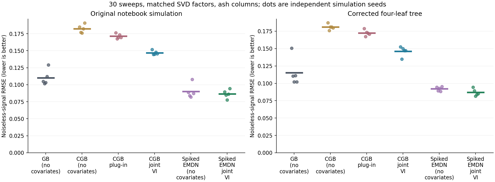
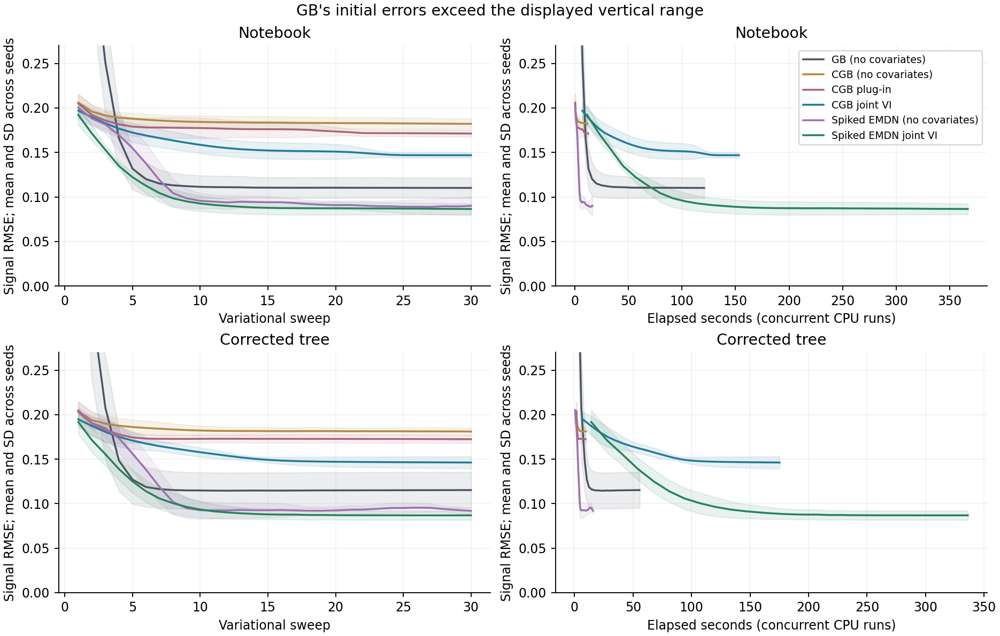
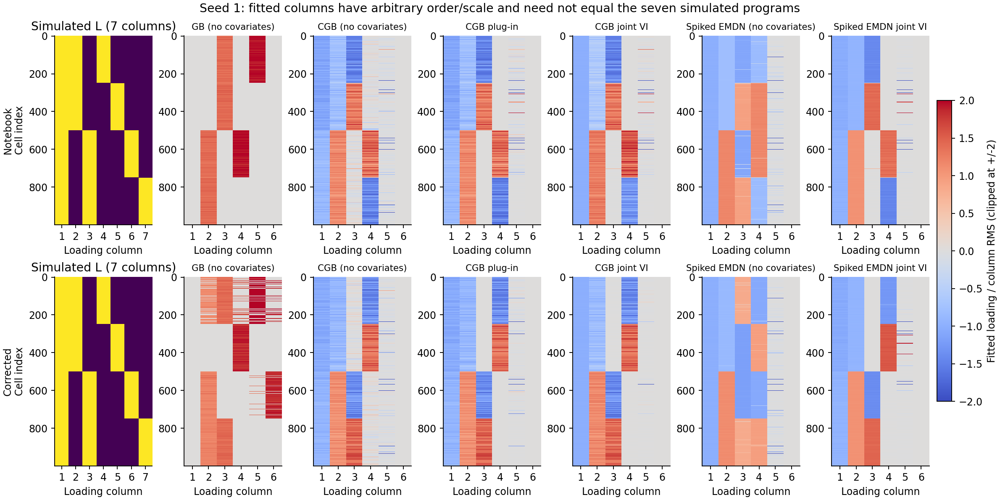

# Tree-prior benchmark and notebook audit

**Version note (16 September 2026):** these saved fits precede the subsequent
[numerical/device corrections](../review_joint_l/NUMERICAL_DEVICE_AUDIT.md).
They describe the source hashes in `provenance.json`, not a rerun of the
revised code. The original notebook and benchmark measurements are retained.

## What this benchmark establishes

With the recorded implementation and this fixed training budget, conditional
spiked EMDN gives the lowest average denoising error among the three requested
configurations. Conditional CGB improves on the old plug-in CGB update, but
does not beat the ordinary generalized-binary baseline. Most of the gain from
spiked EMDN is also available without latent covariates, at much lower cost.
These results do not establish a general advantage of hierarchical learning.

The additional checks point to prior shape and initialization as important
contributors. They provide little evidence that *local integration accuracy at
the fitted solution* explains the performance gap. They do not prove global
optimizer convergence or assess error from the factorized posterior.

## Main experiment

There are 60 completed main fits: six configurations, two simulations and five
seeds (1 through 5). Every fit uses 1,000 rows, 200 columns, six factors, the
same observed matrix and initial SVD factors within a seed, 30 complete sweeps,
estimated constant noise, ash columns (`prior_F="norm"`, penalty 10), and no
factor pruning. The true observation-noise SD is 1.25. The source notebook's
simulation was reproduced bit for bit at seed 1.

Neural fits share a 12-unit ReLU network with no additional hidden layers,
two inner epochs per loading per sweep, batch size 128, learning rate 0.01 and
spike penalty 1.05. Spiked EMDN has three components in total (one spike and two
Gaussian slabs). The conditional solver uses eight quadrature points and eight
fixed Sobol parent points. These are preset compact benchmark settings, not the
package defaults and not a hyperparameter search. The ordinary GB baseline uses
`prior_L="gbinary"` and its default omega=0.1.

The primary score is RMSE against the noiseless simulated signal, not the noisy
training data. Truth never enters initialization, covariates, model fitting or
selection of a training checkpoint: all results use the prespecified last sweep.
There is no held-out-data experiment in the main table. Error against known
simulation truth directly measures denoising in these simulations.

### Main results: mean +/- sample SD over five seeds

| Simulation | Row prior / update | Signal RMSE, mean +/- SD | Median seconds |
| --- | --- | ---: | ---: |
| notebook | GB (no covariates) | 0.1102 +/- 0.0113 | 120.8 |
| notebook | CGB (no covariates) | 0.1821 +/- 0.0061 | 11.8 |
| notebook | CGB plug-in | 0.1713 +/- 0.0036 | 12.6 |
| notebook | CGB joint VI | 0.1469 +/- 0.0030 | 153.2 |
| notebook | Spiked EMDN (no covariates) | 0.0900 +/- 0.0103 | 16.5 |
| notebook | Spiked EMDN joint VI | 0.0865 +/- 0.0061 | 366.8 |
| corrected | GB (no covariates) | 0.1153 +/- 0.0202 | 55.6 |
| corrected | CGB (no covariates) | 0.1811 +/- 0.0040 | 9.7 |
| corrected | CGB plug-in | 0.1724 +/- 0.0043 | 9.5 |
| corrected | CGB joint VI | 0.1462 +/- 0.0068 | 175.2 |
| corrected | Spiked EMDN (no covariates) | 0.0920 +/- 0.0031 | 15.8 |
| corrected | Spiked EMDN joint VI | 0.0869 +/- 0.0051 | 336.1 |

Runtime is elapsed fitting time per process on CPU with one torch thread,
excluding SVD initialization. Independent processes ran concurrently, so these
are practical cost measurements, not isolated hardware benchmarks. Equal sweeps
and neural settings do not imply equal wall time, parameter count, internal
initialization or optimizer work. In particular, ordinary CGB uses its existing
variance update, while the conditional solver optimizes the profiled objective.





The reported neural penalties apply per row; GB has its own fixed-width slab
constraint and no directly matched neural spike penalty. Comparing GB with CGB
therefore compares complete configured methods, not just the dependency flag.
The no-covariate CGB and no-covariate spiked-EMDN controls are essential.

### Paired differences on the same simulations

Negative differences favor the first method. Five replicates are a limited
simulation check, not a broad benchmark or a significance claim.

| Simulation | First minus second | Mean RMSE difference +/- SD | First wins |
| --- | --- | ---: | ---: |
| notebook | CGB joint VI minus CGB plug-in | -0.0244 +/- 0.0010 | 5/5 |
| notebook | Spiked EMDN joint VI minus GB (no covariates) | -0.0237 +/- 0.0077 | 5/5 |
| notebook | Spiked EMDN joint VI minus Spiked EMDN (no covariates) | -0.0035 +/- 0.0109 | 2/5 |
| corrected | CGB joint VI minus CGB plug-in | -0.0262 +/- 0.0037 | 5/5 |
| corrected | Spiked EMDN joint VI minus GB (no covariates) | -0.0284 +/- 0.0159 | 5/5 |
| corrected | Spiked EMDN joint VI minus Spiked EMDN (no covariates) | -0.0051 +/- 0.0054 | 4/5 |

## Problems in the supplied notebook

1. **The saved comparison does not isolate self covariates.** Its fitted models
   all set `self_row_cov=True`. It compares cold spiked EMDN against CGB followed
   by a different, sharper CGB family, using different penalties and starts.
2. **The recorded backend is historical.** Saved warnings describe the old joint
   sampler, whose behavior differs from the current variational solver. The large
   fitting cell has a null execution count. Its saved mean RMSEs, 0.1066 and
   0.0785, cannot be treated as verified results of its currently displayed code.
3. **Four leaf factors reuse `t11`.** The separately generated `t12`, `t21` and
   `t22` masks are unused. The corrected simulation gives each leaf its own mask.
4. **Three rows have no leaf.** Slices starting at 251, 501 and 751 omit zero-based
   rows 250, 500 and 750. The notebook thus has six distinct loading patterns and
   signal rank 6. The corrected tree assigns every row to a leaf: four patterns,
   signal rank 4. `N=2000` is also overwritten by `N=1000` before simulation.
5. **The warm start changes only first moments.** Direct assignments to `L` and
   `F` leave `L2`, `F2` and other initialized state inconsistent. The benchmark
   uses `initialise_factors(L=..., F=...)` instead.
6. **The plotting list is misindexed.** Both cold and warm estimates are appended
   to `res_no_warm`; indexing it by the replicate number mixes the two fits.

The original notebook was read and left unchanged. Its SHA256, source hashes and
runtime versions are stored in [provenance.json](provenance.json).

## Why this is not an identifiable seven-program recovery problem

In the corrected tree, `L_root = L_branch1 + L_branch2`, and each branch loading
is the sum of its two leaf loadings. Four leaf indicators already span the whole
signal. The additive root/branch/leaf feature decomposition is not uniquely
determined by the observations. A loading heatmap that looks different from the
seven-column truth need not imply a poor reconstructed signal or a code error.

The notebook's three exceptional rows break two of those linear relations and
raise the signal rank to six. Fixing both simulation mistakes changes the data
distribution; differences between its two benchmark columns cannot be attributed
to either correction alone.



## Prior shape and initialization

`gbinary`, `cgb` and `spiked_emdn` are not the same prior with different gates.
GB uses a nonnegative truncated-normal slab with SD tied to its mean through
omega. CGB uses one unrestricted Gaussian slab and a learned activation gate;
its slab mean and variance are global within a loading column. Spiked EMDN can
use several Gaussian means and variances, which also depend on its inputs.

The signed SVD basis need not have binary-valued columns, even though the
simulation's chosen generating basis is binary. For notebook seed 1, the
conditional CGB fit's second loading has a single slab with mean about 3.73 and
SD 8.99. The spiked-EMDN fit instead uses slab means near -9 and +10 with SDs
about 0.3. This is consistent with a difficulty representing signed contrast
clusters with one Gaussian slab. It is a diagnosis of these fitted solutions,
not a proof that CGB cannot find a better factorization.

### SVD signs matter for the nonnegative GB prior

In notebook seed 1 the first SVD loading has mean -13.16. Under GB it collapses
to zero and stays inactive. Flipping paired columns of L and F preserves their
product but changes their compatibility with a nonnegative prior. The following
diagnostic makes every initial loading-column mean nonnegative using only the
observed-data SVD; it does not use the simulated tree.

| Simulation | GB default SVD, K=6 | GB sign-oriented SVD, K=6 |
| --- | ---: | ---: |
| notebook | 0.1102 +/- 0.0113 | 0.1112 +/- 0.0076 |
| corrected | 0.1153 +/- 0.0202 | 0.1160 +/- 0.0073 |

This is a sensitivity check for GB, not a second matched benchmark of every
method under sign-oriented initialization. It shows why default-start rankings
should not be interpreted as rankings of the best attainable model fits.

### Corrected tree at K=4: three seeds

| Row prior / update | Raw SVD RMSE | Sign-oriented SVD RMSE |
| --- | ---: | ---: |
| GB (no covariates) | 0.2968 +/- 0.1730 | 0.1124 +/- 0.0037 |
| CGB joint VI | 0.1456 +/- 0.0091 | Not run |
| Spiked EMDN joint VI | 0.0829 +/- 0.0038 | Not run |

### Warm start and additional optimization: notebook seed 1 only

Both conditional models were also initialized from the same ten-sweep GB fit
and given twenty further sweeps (thirty total). This changes the basin of the
factorization and does not transfer neural weights or simulation truth.

| Conditional row prior | Cold 30 sweeps | GB 10 + conditional 20 sweeps |
| --- | ---: | ---: |
| CGB joint VI | 0.1517 | 0.1075 |
| Spiked EMDN joint VI | 0.0893 | 0.0827 |

Continuing the cold CGB solution for ten more sweeps with ten inner epochs instead of two changed its RMSE from 0.15173 to 0.15154. More local optimization did not remove this gap; this does not prove a global optimum.

## Could sampling or integration explain the gap?

These fits use no MCMC chains. They use deterministic quadrature and fixed,
seeded Sobol integration of uncertain parents. At the fitted notebook-seed-1
solutions, a check on 67 rows (including all three exceptional rows) compared
the local coordinate profiles with a 48-point / 256-parent-point reference.

| Model | Reconstruction RMS difference, 8/8 versus 48/256 | 16/32 versus 48/256 |
| --- | ---: | ---: |
| cgb | 0.000258 | 0.000059 |
| spiked | 0.000258 | 0.000079 |

This holds model parameters and the other stored variational coordinates fixed;
the displayed signal difference combines candidate coordinate means as a local
diagnostic, not a newly trained model. It does not rerun entire optimization
trajectories at higher resolution, prove integration convergence, or measure
the error from factorizing the posterior across loadings. Those remain distinct
questions. The observed local integration changes are much smaller than the
CGB-versus-spiked-EMDN error difference here.

## Rare rows are still difficult

The three exceptional notebook rows carry only 0.3% of the total score.
These errors use separate within-subset denominators; they must not be averaged
equally to reconstruct the overall RMSE.

| Row prior / update | Common 997 rows: mean RMSE | Exceptional 3 rows: mean RMSE |
| --- | ---: | ---: |
| GB (no covariates) | 0.1058 | 0.5609 |
| CGB (no covariates) | 0.1807 | 0.4609 |
| CGB plug-in | 0.1696 | 0.4601 |
| CGB joint VI | 0.1448 | 0.4696 |
| Spiked EMDN (no covariates) | 0.0849 | 0.5485 |
| Spiked EMDN joint VI | 0.0819 | 0.5103 |

## Reproduce and inspect

The readable notebook is `examples/benchmark_tree_priors.ipynb`. Scripts live in
`examples/benchmarks/tree/`. From the repository root:

```powershell
python examples/benchmarks/tree/benchmark_tree_priors.py --steps 30 --epochs 2 --hidden 12 --layers 0 --quadrature 8 --parents 8 --methods gbinary cgb cgb_plugin cgb_self spiked spiked_self
python examples/benchmarks/tree/summarize_tree_benchmark.py
```

The main driver defaults to seeds 1-5 and both simulations. It skips completed
identical configurations. Do not run the same unfinished configuration in two
processes at once. The `rank4`, `sign_orientation`, `rank4_oriented`, `warm_start`
and integration JSON files record every diagnostic's configuration; the notebook
shows their reproduction commands. `pilot` folders are timing checks, excluded
from all main summaries. Saved `.pt` checkpoints come from local runs only.

No production fitting code was changed for this benchmark. The old plug-in
control is isolated in a benchmark-only subclass; the public `self_row_cov=True`
path remains the conditional variational algorithm. The original source notebook
was not edited. Main results are five-seed Gaussian simulations with a fixed
budget; they are not a claim about raw-count multi-omics data or general superiority.
